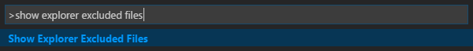
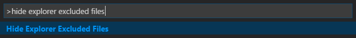

# explorer-excluded-files
Exclude files from the Visual Studio Code explorer

## Description

This extension uses the `files.exclude` setting to exclude specific files from the explorer.

By specifying file patterns to hide in the `explorerExcludedFiles.patterns`
string array setting, you can hide specific files from the explorer.

If you specify a pattern beginning with `file://`, e.g., `"file://.gitignore"`, the pattern
is interpreted as a file and that file is read. It is expected to contain file patterns to hide
in the same format as a `.gitignore` file.

The default value of `explorerExcludedFiles.patterns` if it is not defined is
`[ "file://.gitignore" ]`. To suppress this functionality,
since `explorerExcludedFiles.patterns` is created if not defined, use an empty array,
i.e., `[]`.

## Commands

The following commands are provided to disable/enable the above functionality:

## Extension Settings

This extension contributes the following settings:

* `explorerExcludedFiles.patterns`: string array with file patterns to exclude from the explorer
* `explorerExcludedFiles.patterns`: whether or not to show the excluded explorer files

## Changelog

[https://github.com/sadesyllas/explorer-excluded-files/blob/master/CHANGELOG.md](https://github.com/sadesyllas/explorer-excluded-files/blob/master/CHANGELOG.md)
